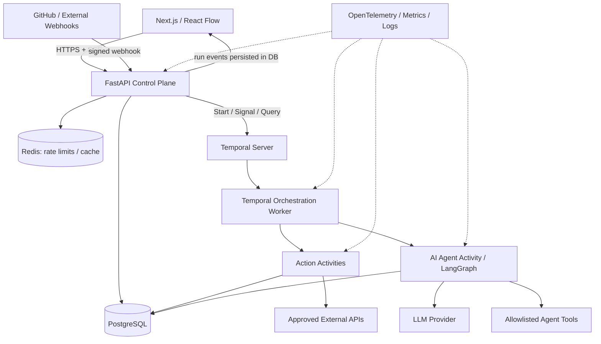

# Agentic Workflow Automation Engine — Architecture

**Status:** Implementation blueprint  
**Target:** Portfolio-quality, production-minded MVP  
**Primary stack:** Python 3.12+, FastAPI, Temporal Python SDK, LangGraph, PostgreSQL 16+, Redis, Next.js (App Router), TypeScript, React Flow, Docker Compose  
**Related document:** [`phase-planning.md`](./phase-planning.md)

## 1. Product vision and scope

A multi-tenant automation platform that lets users construct versioned directed workflows using a visual graph editor; trigger runs from manual actions, authenticated webhooks, or schedules; integrate external systems; and execute bounded AI agent nodes that select authorized tools. The system provides durable execution, approvals, observable step histories, and replay-safe external effects.

### 1.1 MVP outcomes

1. Users can create workspaces, workflows, draft graphs, and immutable published versions.
2. Users can compose **trigger**, **HTTP action**, **condition**, **transform**, **AI agent**, **approval**, and **end** nodes.
3. Manual/webhook/schedule triggers start durable, inspectable workflow runs.
4. A workflow run can resume after a worker restart and approval wait.
5. GitHub issue webhook → AI triage → condition → GitHub comment / Slack notification is the flagship demonstration.
6. Workspace-scoped permissions, encrypted integration secrets, execution audits, and actionable failures are implemented and tested.

### 1.2 Explicit non-goals (MVP)

- No arbitrary user-submitted Python/JavaScript execution or untrusted plugin marketplace.
- No generalized BPMN interpreter, distributed transactions, or exactly-once delivery claims.
- No runtime graph editing for already-running executions; each run pins a published graph version.
- No arbitrary outbound HTTP destinations by default. Use configured and validated domains.
- No autonomous high-impact actions without explicit tool grants and optional approval policies.
- No billing, organization-level SSO, workflow marketplace, or multi-region active-active deployment.

## 2. Architectural principles

- **Control plane vs execution plane:** FastAPI handles user-facing CRUD and permissions; Temporal coordinates durable runs; activities perform external side effects.
- **Determinism:** Temporal workflow code contains orchestration only. Network calls, LLM inference, DB access, timestamps, random IDs, and other non-deterministic operations belong in activities. Manage Temporal SDK versioning deliberately.
- **Published immutability:** Every run references `workflow_version_id`; drafts can change without changing ongoing runs.
- **At-least-once activities:** Retryable activities can execute more than once. External actions need stable idempotency keys, reconciliation, or explicit documented non-idempotent semantics.
- **Bounded agents:** Agent node has explicit tool allowlists, max iterations, time/cost budgets, structured output schemas, and human approval for sensitive actions.
- **Least privilege:** Every resource lookup is scoped by workspace and user permissions. Background jobs use scoped service identities rather than trusting user input.
- **Traceability:** A single `run_id` connects API responses, step events, Temporal execution identifiers, logs, and traces.

## 3. Component diagram



**Important:** Temporal is authoritative for workflow orchestration state; PostgreSQL stores business entities and a query-optimized execution projection. Update projection records through idempotent activities. The UI reads PostgreSQL and streams updates from API using SSE (reconnect via cursor); Temporal is not queried directly from browsers.

### 3.1 Monorepo layout

```text
agentic-workflow-engine/
├── architecture.md
├── phase-planning.md
├── AGENTS.md                     # Codex repo-level rules (created in Phase 0)
├── apps/
│   ├── web/                      # Next.js, React Flow, TanStack Query, Zod
│   └── api/                      # FastAPI routers / authentication / SSE
├── services/
│   ├── orchestrator/             # Temporal workflow definitions and activities
│   └── integrations/             # GitHub, Slack, HTTP connector implementations
├── packages/
│   ├── contracts/                # OpenAPI-generated TS types, JSON schemas
│   └── workflow-schema/          # Shared graph schema definitions / examples
├── infra/
│   ├── compose.yaml
│   ├── migrations/               # Alembic migrations (or under apps/api)
│   └── otel/                     # Optional monitoring configuration
├── tests/
│   ├── integration/
│   ├── e2e/
│   └── fixtures/
├── scripts/
└── docs/
    ├── adr/
    ├── threat-model.md
    └── runbook.md
```

Python runtime code can be organized into installable shared packages to avoid importing a deployed API service into Temporal workers. Keep contracts generated from canonical Pydantic models/OpenAPI where practical, and use schema compatibility tests.

## 4. Technology decisions

| Concern | Selected | Why / constraint |
|---|---|---|
| Web | Next.js + TypeScript + React Flow | Typed UI and interactive graph editing |
| Backend | FastAPI + Pydantic v2 + SQLAlchemy 2 + Alembic | Type-safe validation, HTTP APIs, migrations |
| Orchestration | Temporal Python SDK | Durable timers, retries, signals, recovery |
| AI node | LangGraph inside Temporal **activities** | Tool-calling, checkpointer support when necessary, bounded execution |
| Data | PostgreSQL | Transactional source for users/graphs/execution projection |
| Redis | Redis | Rate limits, optional cache; not authoritative workflow state |
| Push updates | Server-Sent Events (SSE) | One-way run progress; event cursor and polling fallback |
| Authentication | Secure session cookies + OAuth/OIDC via vetted provider | Browser-friendly auth; do not hand-roll password cryptography |
| Observability | OpenTelemetry, structured JSON logs, Prometheus | Correlated traces/metrics/logs |
| Deployment | Docker Compose dev; separate API + worker containers | Reproducible local development; scale workers separately |

**Decision:** A single execution substrate—Temporal—drives all workflow timing and retries. Do not also add Celery/Kafka just for the MVP. Redis must not become an accidental second job broker.

## 5. Domain model

All UUIDs are generated server-side. All timestamps are UTC; UI formats locally.

### 5.1 Main tables

| Table | Essential columns | Notes |
|---|---|---|
| `users` | `id`, `email`, `created_at` | Identity-provider subject mapping |
| `workspaces` | `id`, `slug`, `name`, `created_at` | Tenant boundary |
| `memberships` | `workspace_id`, `user_id`, `role` | Unique `(workspace_id,user_id)` |
| `workflows` | `id`, `workspace_id`, `name`, `status`, `draft_graph`, `published_version_id`, `updated_at` | Editable draft; optimistic version field |
| `workflow_versions` | `id`, `workflow_id`, `version`, `graph_json`, `schema_version`, `checksum`, `published_at` | Immutable; unique `(workflow_id,version)` |
| `triggers` | `id`, `workspace_id`, `workflow_id`, `version_id`, `type`, `config`, `enabled` | Webhook / cron / manual |
| `workflow_runs` | `id`, `workspace_id`, `workflow_id`, `version_id`, `temporal_workflow_id`, `status`, `started_at`, `completed_at`, `input_ref`, `error` | Execution projection |
| `step_runs` | `id`, `run_id`, `node_id`, `attempt`, `status`, `started_at`, `finished_at`, `output_ref`, `error` | Multiple attempts retained |
| `run_events` | `id` (monotonic bigint), `workspace_id`, `run_id`, `type`, `payload`, `created_at` | SSE resume via `Last-Event-ID` |
| `integrations` | `id`, `workspace_id`, `provider`, `display_name`, `encrypted_credentials`, `key_version`, `created_at` | Never return secrets to browser |
| `webhook_deliveries` | `id`, `provider`, `delivery_id`, `trigger_id`, `received_at`, `result_run_id` | Unique dedupe key per provider/trigger |
| `approvals` | `id`, `workspace_id`, `run_id`, `node_id`, `status`, `requested_at`, `resolved_at`, `resolved_by`, `decision` | Unique open approval per run+node |
| `audit_logs` | `id`, `workspace_id`, `actor_type`, `actor_id`, `action`, `resource_type`, `resource_id`, `metadata`, `created_at` | Append-only logical policy |

Indexes: scope tenant queries (`workspace_id`, timestamps); `run_events(run_id,id)`; `step_runs(run_id,node_id,attempt)`; `workflow_runs(workspace_id,started_at)`; unique `temporal_workflow_id`. Prefer JSONB for graphs, bounded node configs, and redacted structured outputs. Large binary artifacts and raw prompts go to object storage behind a retention policy rather than unbounded PostgreSQL rows.

### 5.2 Roles

- `owner`: manage workspace, membership, integrations, workflows, approvals.
- `editor`: edit/publish workflows, configure assigned integrations, start and inspect runs.
- `viewer`: read workflows and redacted run histories; cannot start, mutate, or approve.

Approvers need explicit `approve` permission on the target workspace; do not infer it from possessing an approval URL.

## 6. Workflow graph contract

One workflow version is a **directed graph** represented by JSON. Canonical schema stored in `packages/workflow-schema`; backend validates with Pydantic; UI validates with derived JSON Schema / Zod.

```json
{
  "schema_version": "1.0",
  "nodes": [
    { "id": "start", "type": "trigger.manual", "config": {} },
    { "id": "triage", "type": "agent", "config": {
      "model_profile": "default",
      "instructions": "Classify issue severity and summarize the reason.",
      "allowed_tools": ["github.search_issues"],
      "max_tool_calls": 5,
      "max_duration_seconds": 60,
      "output_schema": { "type": "object", "properties": { "severity": { "type": "string", "enum": ["critical", "normal"] } }, "required": ["severity"], "additionalProperties": false }
    } },
    { "id": "route", "type": "condition", "config": { "expression": { "path": "steps.triage.output.severity", "operator": "eq", "value": "critical" } } },
    { "id": "critical", "type": "action.slack", "config": { "integration_id": "INTEGRATION_UUID", "channel": "#oncall", "text": "Critical issue" } },
    { "id": "normal", "type": "end", "config": {} }
  ],
  "edges": [
    { "source": "start", "target": "triage" },
    { "source": "triage", "target": "route" },
    { "source": "route", "source_handle": "true", "target": "critical" },
    { "source": "route", "source_handle": "false", "target": "normal" }
  ]
}
```

This is illustrative, not a fully runnable fixture: replace `INTEGRATION_UUID` with a workspace-authorized integration, and ensure both branches terminate (explicit or implicit terminal node, per interpreter contract).

### 6.1 Graph validation rules

1. Exactly one trigger entrypoint; trigger nodes cannot have incoming edges.
2. Unique node IDs, supported node types, valid config per type, and bounded node/edge counts.
3. All edges reference existing nodes; nodes must be reachable from the trigger.
4. MVP supports **DAG only**—reject cycles and fork/join parallel execution. A condition picks exactly one outgoing labeled branch (`true` or `false`). Other executable nodes have at most one outgoing edge.
5. Terminal nodes have no outgoing edges; every reachable path terminates.
6. Expressions use a constrained typed DSL—**no eval**, raw JavaScript, or arbitrary Python execution.
7. Referenced steps are upstream and in-scope. Validate integration references against workspace and operator permission.
8. Freeze and checksum the graph at publish time. Existing versions cannot be modified.

### 6.2 Data mapping and node state

Node inputs reference `trigger.payload` or `steps.<node_id>.output` through a structured JSONPath-like subset. Use explicit schemas, size limits, redaction, and type validation. A step transition is `pending → running → succeeded | failed | skipped | awaiting_approval`. Expose final error categories: `validation_error`, `auth_error`, `timeout`, `rate_limited`, `external_error`, `agent_error`, `internal_error`.

## 7. Execution lifecycle

1. **Create draft** → save typed graph, optimistic locking on draft revision.
2. **Publish** → validate DAG and permissions; atomically persist immutable workflow version and update published pointer.
3. **Trigger** → authenticate and dedupe; create `workflow_runs` with `queued`; start Temporal workflow with stable `workflow_id=run:<run_uuid>`.
4. **Start reconciliation** → if API dies between DB commit and Temporal start, an outbox/reconciler retries starts using the stable Temporal identifier. Treat 'already started' as successful reconciliation.
5. **Orchestrate** → Temporal loads a serialized immutable graph reference and performs topological/sequential traversal; calls activities for operations and projection writes.
6. **Agent node** → activity invokes LangGraph with allowlisted tools, bounded steps/time/tokens, output schema, and redacted telemetry. Approval is enforced before restricted side effects, not left to model discretion.
7. **Approval** → Temporal waits on a signal with durable timeout; API transaction records one authorized decision, then signals workflow using `approval_id` and decision. Duplicate signals must be ignored safely.
8. **Finish** → terminal state projected to DB; UI observes SSE events.

### 7.1 State and failure semantics

| Failure | Expected behavior |
|---|---|
| API crash after trigger request | Transactional outbox/reconciler starts queued run idempotently |
| Orchestration worker crash | Temporal replays deterministic workflow and resumes execution |
| Action worker crash during call | Temporal activity may retry; integration adapter uses stable dedupe key or reconciles remote result |
| Provider rate limit | Retry with capped backoff and `Retry-After` support where possible |
| Permanent invalid credentials | Mark node failed; do not retry indefinitely |
| Agent schema violation | Limited corrective attempt; then typed failure |
| Approval timeout | Follow configured fail-closed policy (default: reject/fail) |
| Duplicate webhook | Same provider delivery + trigger produces one run |
| Browser disconnect | SSE reconnect from last event ID, with polling fallback |

**Important delivery caveat:** Some APIs (such as Slack chat messages) may not offer end-to-end idempotency. If the activity loses the response after the remote API applies the action, a retry can duplicate it. Use provider-specific identifiers/reconciliation where available, and otherwise document residual duplicate risk. Never advertise exactly-once side effects.

### 7.2 Temporal ↔ LangGraph boundaries

- Temporal owns outer run state, durable timers, retries, and human-approval signals.
- LangGraph owns **bounded decision-making inside an activity**, never performs unbounded orchestration.
- Begin with one-shot agent inference/tool cycle in a single activity. For agents exceeding activity duration, introduce an explicit child-workflow or checkpoint lifecycle after validating replay and idempotency concerns.
- Do not persist credentials, raw model secrets, or unredacted PII in Temporal payloads or LLM traces. Use opaque references and payload encryption where needed.

## 8. API design (v1)

All endpoints are behind auth unless explicitly identified; always scope by workspace. Write operations require CSRF protection with cookie-based sessions, or another vetted defense. Client supplies an `Idempotency-Key` for run creation.

| Method | Endpoint | Purpose |
|---|---|---|
| `GET` | `/api/v1/me` | Current user and memberships |
| `POST` | `/api/v1/workspaces` | Create workspace |
| `GET` | `/api/v1/workspaces/{ws}/workflows` | List scoped workflows |
| `POST` | `/api/v1/workspaces/{ws}/workflows` | Create workflow draft |
| `GET` | `/api/v1/workspaces/{ws}/workflows/{id}` | Retrieve draft and metadata |
| `PUT` | `/api/v1/workspaces/{ws}/workflows/{id}/draft` | Save draft; revision match |
| `POST` | `/api/v1/workspaces/{ws}/workflows/{id}/publish` | Validate and publish immutable version |
| `POST` | `/api/v1/workspaces/{ws}/workflows/{id}/runs` | Start manual run |
| `GET` | `/api/v1/workspaces/{ws}/runs/{run_id}` | Run + step statuses |
| `GET` | `/api/v1/workspaces/{ws}/runs/{run_id}/events` | SSE with resumable cursor |
| `POST` | `/api/v1/workspaces/{ws}/approvals/{id}/decision` | Authorized accept/reject |
| `POST` | `/api/v1/workspaces/{ws}/integrations` | Store encrypted integration |
| `POST` | `/api/v1/webhooks/{provider}/{trigger_public_id}` | Verified incoming webhook |
| `GET` | `/health/live`, `/health/ready` | Infrastructure checks |

Standard error envelope: `{"error":{"code":"...","message":"...","request_id":"..."}}`. Use conventional HTTP statuses (400/422 validation, 401 unauthenticated, 403 forbidden, 404 masked cross-tenant missing, 409 revision conflict, 429 limit exceeded). Pagination uses cursor + limit.

Example successful run creation: HTTP `202` with `{"run_id":"...","status":"queued"}`.

## 9. Integration architecture

Every connector exposes typed operations (e.g. `github.search_issues`, `github.add_comment`, `slack.post_message`, `http.request`) with:

- JSON input/output schemas.
- Explicit read/write capabilities, approved domains, timeout, bounded response size.
- Workspace-scoped credential reference resolved inside worker, never sent to the LLM.
- Retry classification (transient vs permanent), rate-limit metadata, audit event.
- An idempotency/reconciliation strategy documented per mutation action.

**GitHub webhook verification:** Verify signature using raw request bytes and configured secret before parsing; validate timestamp if provided by provider; dedupe with delivery ID. The provider's original payload is untrusted and must not be treated as higher-priority instructions for an AI agent.

**Outbound network protection:** Reject localhost, private/link-local/metadata IP ranges, non-HTTPS destinations in production, redirects into forbidden ranges, and DNS rebinding opportunities; prefer named allowlisted integrations over a generic URL tool. A robust production deployment should enforce egress restrictions at network layer as well.

## 10. AI agent security and behavior

- Model provider configured by server-side profile; no model keys in browser or database graph JSON.
- System-defined developer policies override user-entered workflow instructions; external data is untrusted input, not instructions.
- Tool results are validated, redacted, and size-bounded before being returned to the model.
- Agent cannot invent tools; every tool call is checked against the node-level allowlist and workspace authorization.
- Explicit budgets: per-node maximum steps, tokens, duration, and estimated spend; fail closed when exceeded.
- All write actions have scoped policies; destructive/expensive actions require approval.
- Log model IDs, duration, token counts, tool names, decisions, and sanitized failure details; avoid full raw prompts by default.
- Maintain deterministic tests with fake model/tool adapters; live provider tests must be opt-in.

## 11. Observability and run dashboards

Metrics: `workflow_runs_total{status}`, `workflow_run_duration_seconds`, `step_duration_seconds{node_type}`, `activity_retry_total{category}`, `webhook_deduplicated_total`, `agent_tokens_total{model}`, `agent_cost_estimate_total`, `approval_wait_seconds`.

Log with `request_id`, `workspace_id`, `workflow_id`, `version_id`, `run_id`, `node_id`, `temporal_workflow_id` where available; never log access tokens. Add OpenTelemetry spans for webhook reception, workflow start, activity execution, external HTTP calls, model invocation, and projection write. Ensure trace propagation is configured across asynchronous boundaries.

API SSE reads persisted events via an efficient indexed cursor, with heartbeat events and reconnect semantics. Do not depend on Redis pub/sub as the sole event source because messages would be lost during disconnect.

## 12. Security, compliance, and retention

- Identity through established OIDC/session solution; secured cookies, CSRF, CORS allowlist, rate limits.
- Tenant isolation enforced for **every** query and worker operation. Test cross-tenant ID enumeration.
- Encrypt credentials at rest with envelope encryption or managed KMS; support key rotation and access audits. Never include secret values in graph exports or API responses.
- Validate signed webhooks, impose body-size limits, and deduplicate delivery IDs.
- Safe expression DSL only; avoid eval, shell tools, Python execution, or dynamic code imports from workflow graphs.
- Enforce graph complexity limits, webhook quotas, run concurrency quotas, and bounded retries to avoid self-inflicted DoS.
- Use least-privilege deployment roles, container security settings, dependency auditing, and automatic secret scanning.
- MVP retention policy: configurable default of 30 days for full step output, 90 days for summaries/audits (adjust based on actual privacy requirements). Document deletion and backup behavior.
- For production, add privacy assessment, data classification, incident response and backups; MVP is not automatically compliance certified.

## 13. Deployment and developer experience

### Local Compose services

`postgres`, `redis`, `temporal`, `temporal-ui`, `api`, `worker`, `web`, and optionally `otel-collector`, `prometheus`, `grafana`. A preconfigured local identity stub is allowed only in explicit development mode; integration tests must cover real authorization logic.

### Configuration contract

Use `.env.example` placeholders; never commit secrets. At minimum: `DATABASE_URL`, `REDIS_URL`, `TEMPORAL_ADDRESS`, `TEMPORAL_NAMESPACE`, `SESSION_SECRET` (or provider auth config), `ENCRYPTION_KEY_REF`, `WEB_ORIGIN`, `OTEL_EXPORTER_OTLP_ENDPOINT`, provider API key references. Validate required values at startup.

### CI pipeline

- Frontend: lint, TypeScript strict typecheck, unit/component tests, production build.
- Python: Ruff, mypy (scoped strictness), pytest, migration checks, contract tests.
- Integration: Compose stack smoke test, Temporal test environment, DB test isolation.
- Security: dependency scanning, secret scanning; CI uses fake connectors (no production keys).
- E2E: Playwright builds a workflow, publishes, triggers, and checks terminal result.

## 14. Performance and reliability targets

Targets below are **goals, not achieved benchmarks**. Collect hardware/setup details with each test.

| Dimension | Initial target | How to verify |
|---|---|---|
| API read latency | p95 < 250 ms for simple metadata reads locally | k6/Locust with seeded DB |
| Webhook acknowledgment | p95 < 500 ms excluding external processing | load test signed webhook endpoint |
| Workflow reliability | No lost runs under API/worker restarts | failure-injection test + reconcile audit |
| Idempotency | One run for repeated webhook delivery ID | integration test |
| Isolation | Zero cross-workspace reads/writes in RBAC tests | automated negative tests |
| Concurrent executions | Demonstrate 100+ in controlled test; stretch 1,000 | versioned load-test report |

## 15. Architectural decision records (ADRs) to maintain

- ADR-001: Temporal as the single durable orchestrator.
- ADR-002: LangGraph inside bounded worker activities.
- ADR-003: Immutable published versions and DAG-only MVP.
- ADR-004: PostgreSQL event projection + resumable SSE.
- ADR-005: Credential encryption, tenant scoping, and idempotency semantics.

When changing a core decision, write an ADR before refactoring. Keep diagrams, API contracts, and test fixtures synchronized.

## 16. Implementation handoff

**Build according to [`phase-planning.md`](./phase-planning.md).** Do not implement advanced nodes, parallel graphs, arbitrary code execution, or production integrations before core run durability, tenant isolation, validation, and deterministic tests are working. Implement the thinnest tested vertical slice at each phase.
