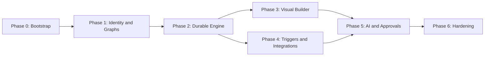

# Agentic Workflow Automation Engine — Phased Implementation Plan for Codex

**Source of truth:** [`architecture.md`](./architecture.md)  
**Audience:** Codex coding agent running inside the project repository  
**Cadence:** Eight indicative weeks, with phase-gates instead of fixed-date promises  
**Principle:** One small verifiable vertical slice at a time; no broad speculative scaffolding.

## 0. Codex operating instructions

Read `architecture.md` in full and the current phase before coding. At every work session:

1. Inspect repository state, `git status`, existing code/tests, and the last checked-off phase task.
2. Choose the **smallest incomplete task** from the active phase. State affected paths, expected behavior, and tests before editing.
3. Implement complete slices: database migration + server contract + authorization + tests + UI changes, if relevant.
4. Use descriptive, scoped commits. Do **not** commit secrets, generated credential files, or fragile screenshots.
5. Run targeted tests and relevant lint/type checks. Report commands, outcomes, and anything not run.
6. Update the task checkboxes, `docs/adr/` when decisions change, and `CHANGELOG.md` for user-visible functionality.
7. Stop at a phase gate and produce a handoff summary; do not silently proceed to the next phase until criteria pass.

**Non-negotiable engineering rules**

- Follow `architecture.md`; for departures, write ADR and explain tradeoffs.
- Enforce workspace authorization at every API/resource lookup; never trust workspace IDs from node payloads.
- Temporal workflow code must remain deterministic; all external I/O in activities.
- Assume Temporal activities are at-least-once, not exactly-once.
- Use encrypted credential references, never plaintext secrets in workflow JSON, logs, or model prompts.
- No `eval`, shell execution of node text, arbitrary scripts, or unrestricted network requests.
- Prefer typed interfaces and migrations over loose dict-based APIs.
- Keep tests offline/deterministic with fake GitHub/Slack/LLM providers by default.
- Fail closed on unknown node types, invalid graph structure, failed authorization, unsafe tools, or approval timeouts.
- Do not describe benchmark targets as accomplished until a reproducible report exists.

### Recommended `AGENTS.md`

At Phase 0, create a root `AGENTS.md` that references these two documents, summarizes the constraints above, and instructs Codex to work through the phase checklist. Maintain concise nested `AGENTS.md` files only when local subsystem rules materially differ.

### Definition of done — every task

- [ ] Implementation matches contract and uses typed input/output.
- [ ] Success, validation failure, authorization failure, and retry/error behaviors are tested where applicable.
- [ ] Database schema change has forward migration, indexes, and notes on rollback.
- [ ] Secrets/PII are not printed or committed.
- [ ] Lint, type checks, tests and builds relevant to the change pass.
- [ ] Documentation and phase checklist updated.

## Phase 0 — Repository bootstrap and engineering baseline (Days 1–3)

**Goal:** Repeatable local stack, code quality, contracts, and developer onboarding before domain features.

### Tasks

- [x] **P0-01** Create monorepo layout from architecture §3.1; root `README.md`, `AGENTS.md`, `.gitignore`, `.env.example`, `Makefile`/task runner.
- [x] **P0-02** Initialize Python API + worker packages, dependency lockfiles, Ruff, mypy, pytest, and Pydantic configuration.
- [x] **P0-03** Initialize Next.js App Router, TypeScript strict, ESLint, Tailwind, component test runner and React Flow dependency.
- [x] **P0-04** Add Docker Compose for PostgreSQL, Redis, Temporal + UI, FastAPI, worker and web; health checks and persistent volumes.
- [x] **P0-05** Create basic `/health/live` and `/health/ready` endpoints; add typed config startup validation.
- [x] **P0-06** Add CI for lint, type check, tests, and frontend production build; secret scan and dependency scan.
- [x] **P0-07** Write ADRs 001–005 stubs, development runbook, and a reproducible one-command startup/smoke test.

**Phase 0 verification note (2026-10-08):** P0-03's routine component-test obligation was replaced by a full-stack Playwright E2E check under `AGENTS.md` §6. Local Compose startup, Temporal/PostgreSQL smoke, browser E2E, static checks, production build, and dependency audits passed. At the Phase 0 handoff, the CI workflow existed but its green status and the fresh-clone gate had not been observed; no Phase 1 work had started.

**Deliverable:** `docker compose up --build` starts local services; web displays health; API/worker connect to Temporal; no real external service keys needed.

**Gate:** Fresh clone boots using README steps; CI green; integration smoke test proves Temporal worker registered and DB accessible.

## Phase 1 — Identity, tenancy, and workflow definitions (Week 1–2)

**Goal:** Secure workspaces and persist validated, immutable workflow definitions.

### Tasks

- [x] **P1-01** Design tables: users, workspaces, memberships, workflows, workflow_versions, audit_logs; add Alembic migrations/indexes.
- [ ] **P1-02** Integrate vetted OIDC/session authentication; development test identity is isolated to local/test environment.
- [ ] **P1-03** Build membership middleware/services (`owner`, `editor`, `viewer`) with explicit permission matrix.
- [ ] **P1-04** Implement `GET /me` and workspace create/list endpoints; cross-tenant negative tests.
- [ ] **P1-05** Define versioned node/edge Pydantic contracts and shared JSON-schema artifacts. Node types initially: manual trigger, HTTP action stub, condition, end.
- [ ] **P1-06** Implement graph validator: trigger count, IDs, types, edge handles, reachable nodes, DAG, branches, terminal paths, expression DSL, graph limits.
- [ ] **P1-07** Implement workflow draft CRUD with optimistic concurrency / conflict response.
- [ ] **P1-08** Implement publish transaction: validate, increment version, persist immutable graph, compute checksum, atomically update pointer.
- [ ] **P1-09** Add OpenAPI contract checks, unit tests for malformed graphs and permissions, schema compatibility tests.

**P1-01 verification note (2026-10-08):** Revision `0001_phase1_core` applied to local PostgreSQL. `alembic check` found no metadata drift. The schema E2E check passed five integrity cases with synthetic rows and verified full rollback; its JSON report is under ignored `artifacts/e2e/phase1-schema/`. Authentication, workspace API authorization, graph validation, and published-version immutability enforcement remain in later Phase 1 tasks.

**Deliverable:** Authenticated editor can create a workspace, save a draft and publish version 1. Viewer cannot mutate. Existing versions remain byte-stable after draft changes.

**Gate:** Automated suite covers cross-tenant access attempts, invalid graph/cycle/branch rejection, optimistic revision conflicts, and published immutability.

## Phase 2 — Durable engine and run visibility (Week 3)

**Goal:** Execute simple published DAGs, survive crashes, and expose accurate run progress.

### Tasks

- [ ] **P2-01** Migrate `workflow_runs`, `step_runs`, `run_events`, `trigger start outbox` and idempotency tracking.
- [ ] **P2-02** Add manual run API with `Idempotency-Key`, workflow-version pinning, typed input schema, and workspace scopes.
- [ ] **P2-03** Implement atomic DB run creation + outbox and an idempotent Temporal starter/reconciler using `workflow_id=run:<uuid>`.
- [ ] **P2-04** Implement deterministic Temporal workflow for sequential DAG traversal, conditions, node dispatch, completion/failure transitions.
- [ ] **P2-05** Add action activity contract: timeout, retry classification, bounded output, stable side-effect key, structured result.
- [ ] **P2-06** Implement deterministic mock HTTP/action adapter and a restricted real HTTP connector with egress controls; keep disabled by default until security tests pass.
- [ ] **P2-07** Persist idempotent step/run projections and monotonic `run_events` with correlation IDs.
- [ ] **P2-08** Add run inspect endpoint and resumable SSE `Last-Event-ID` stream with heartbeat/polling fallback.
- [ ] **P2-09** Add Temporal testing environment cases for retry, crash/replay, timeout, permanent failure, and duplicate start.

**Deliverable:** `trigger.manual → action.mock → condition → end` runs end-to-end and streams progress. A restarted worker resumes without silently dropping runs.

**Gate:** Fault-injection tests for API crash between DB insert and Temporal start, worker restart, and action retry pass; run state and events reconcile to the same terminal outcome.

## Phase 3 — Visual workflow builder (Week 4)

**Goal:** Build, validate, publish, run, and debug a workflow from browser UI.

### Tasks

- [ ] **P3-01** Create authenticated workspace shell with workflow list, create/rename/archive and role-aware actions.
- [ ] **P3-02** Build React Flow canvas, draggable node palette and typed node configuration form.
- [ ] **P3-03** Add condition branch handles and clear invalid-edge feedback; disallow cycles in client, but rely on server validator as authority.
- [ ] **P3-04** Implement draft save with optimistic revision check, unsaved-changes warning, and server validation diagnostics.
- [ ] **P3-05** Add publish confirmation/version metadata and manual trigger form.
- [ ] **P3-06** Add execution view: per-node status, attempts, sanitized input/output, errors, execution timeline.
- [ ] **P3-07** Subscribe to SSE using cursor reconnect, with polling fallback and loading/empty states.
- [ ] **P3-08** Add Playwright E2E: create workflow → connect nodes → save → publish → run → observe completion.

**Deliverable:** Demonstrable no-code loop with visual status updates and robust UI error states.

**Gate:** Fresh browser user with `editor` role completes E2E without touching API or DB; viewer can inspect but not edit/publish/run.

## Phase 4 — Webhooks, schedules, and connectors (Week 5)

**Goal:** Implement secure real-world triggers and two integrations.

### Tasks

- [ ] **P4-01** Implement encrypted integration credentials with rotation metadata, least-privilege worker resolution and redacted API responses.
- [ ] **P4-02** Implement `triggers` and `webhook_deliveries` schemas; public opaque identifiers per trigger.
- [ ] **P4-03** Build webhook handler with raw-body HMAC verification, payload limits, constant-time signature comparison and replay/dedupe behavior.
- [ ] **P4-04** Map incoming GitHub issue events to typed trigger payload; treat issue text as untrusted data.
- [ ] **P4-05** Implement GitHub read-only issue search tool with scoped installation/token handling.
- [ ] **P4-06** Implement GitHub comment action and Slack message action; classify rate limits/errors and document provider-specific idempotency risks.
- [ ] **P4-07** Implement schedule trigger using Temporal Schedules or a single documented scheduler, including timezone and DST behavior; ensure no duplicate start paths.
- [ ] **P4-08** Add full fake provider adapters, signed fixture tests, outbound URL SSRF tests, rate-limit tests, and connector audit records.

**Deliverable:** GitHub event triggers a workflow and produces a message using fake integrations; real external calls work with optional developer credentials.

**Gate:** Invalid signatures rejected, duplicate delivery creates one run, rotated/revoked credential behavior tested, and outbound requests cannot reach private/metadata endpoints.

## Phase 5 — Agentic AI with approvals (Week 6)

**Goal:** Controlled agent decisions with explicit authority boundaries and durable human checkpoints.

### Tasks

- [ ] **P5-01** Add agent node schema: provider profile, instructions, tool allowlist, input/output schema, max tool calls, max duration, token/cost budget.
- [ ] **P5-02** Implement LLM provider interface with fake deterministic adapter and one configurable real provider.
- [ ] **P5-03** Implement LangGraph agent as Temporal activity; bind only authorized tools and validate structured output.
- [ ] **P5-04** Add input sanitization and prompt-injection tests where an issue body requests unauthorized tool invocation or credential exfiltration.
- [ ] **P5-05** Add `approvals` table and approval node; Temporal waits for authorized API signal with timeout and fail-closed default.
- [ ] **P5-06** Build approval inbox, decision endpoint, signed-in permission checks, audit events, and duplicate-decision handling.
- [ ] **P5-07** Add node budget enforcement, tool-call trace summaries, token counts and sanitized execution logs.
- [ ] **P5-08** Demo complete flow: GitHub issue → agent classification → condition → optional approval → GitHub/Slack action.

**Deliverable:** Agent uses read-only GitHub search, emits validated severity classification, and cannot send sensitive messages without configured authorization/approval.

**Gate:** Tests demonstrate unknown tool denial, tool quota enforcement, malformed LLM output failure, prompt-injection resistance, approval timeout, duplicate approval idempotency, and worker restart while approval pending.

## Phase 6 — Hardening, observability, and portfolio launch (Weeks 7–8)

**Goal:** Measured performance, reliable ops, clear public demo and documentation.

### Tasks

- [ ] **P6-01** Add OpenTelemetry tracing, structured logs with trace/run IDs, Prometheus metrics and optional Grafana dashboard.
- [ ] **P6-02** Add concurrency limits, quotas, request rate limiting, per-node timeouts and bounded retries.
- [ ] **P6-03** Implement retention/cleanup routines for old run data and credential-revocation behavior.
- [ ] **P6-04** Run failure-injection matrix across API, worker, Temporal connection, PostgreSQL and external provider failures.
- [ ] **P6-05** Load test API reads, signed webhooks, and concurrent workflows. Record actual throughput, p95 latencies, failure rates, hardware and test settings.
- [ ] **P6-06** Complete threat model, auth/tenant isolation audit, dependency and secret scans, backup/restore test.
- [ ] **P6-07** Polish onboarding, empty states, dashboard, sample templates and demo fixture data.
- [ ] **P6-08** Document setup, API examples, architecture diagram, ADRs, reliability tradeoffs and a short demo script/video outline.
- [ ] **P6-09** Generate measured resume bullets with verifiable metrics only.

**Deliverable:** README-ready open-source portfolio project with an end-to-end demo, deploy guide, screenshots, architecture decisions, CI results, and measured performance report.

**Gate:** All critical tests passing; no known high-severity security issue; recovery and idempotency tests documented; demo works with mock services and optional live credentials; performance claims sourced to reproducible reports.

## Dependency graph



Phase 3 and Phase 4 can proceed in parallel after Phase 2 if different developers own them; contracts must be frozen before parallel work.

## Test matrix (minimum)

| Test category | Critical scenarios | Earliest phase |
|---|---|---|
| Unit | graph cycles, branch handles, typed DSL, limits | P1 |
| Auth | viewer mutation denied, cross-tenant ID blocked | P1 |
| Persistence | immutable publish, revision conflict, migration sanity | P1 |
| Orchestration | retry, timeout, failure, restart, duplicate start | P2 |
| Projection | terminal state correctness, idempotent updates, SSE resume | P2 |
| E2E | create-publish-run-inspect with browser | P3 |
| Webhook | forged HMAC, duplicates, oversized bodies | P4 |
| Integration | 429 handling, redaction, domain/IP blocking | P4 |
| Agent | invalid output, tool escalation, prompt injection, budgets | P5 |
| Approvals | unauthorized user, duplicate decision, timeout, restart | P5 |
| Performance | p95 latency, concurrency, fault recovery | P6 |

## Recommended first four Codex prompts

Execute these **sequentially**, with verification after each. Paste them into Codex in the project root.

### Prompt A — Bootstrap

> Read `architecture.md` and `phase-planning.md`. Implement only Phase 0 tasks P0-01 through P0-05. Create a runnable monorepo with FastAPI, Next.js, Temporal worker, PostgreSQL, Redis, Docker Compose, and health checks. Keep auth/integrations mocked only in explicit dev mode. Update `.env.example`, README and task checkboxes. Run the available checks and report results. Do not implement workflow features yet.

### Prompt B — Auth + workflow definition

> Read both project docs and inspect the current repository. Implement Phase 1 incrementally, starting with data models and migrations. Use workspace-scoped authorization for all routes, immutable published versions, revision-checked drafts, and a strict DAG validator. Add negative tenant-access tests and graph-validation tests. Do not start Phase 2 until the Phase 1 gate is satisfied.

### Prompt C — Durable execution

> Review current code and architecture §7. Implement Phase 2: transactional run creation and outbox, idempotent Temporal starting, deterministic sequential DAG orchestration, idempotent projection activities, step/run events, SSE cursor resume, and mock action execution. Add crash/retry and duplicate-trigger tests. No real LLM, Slack, GitHub or unrestricted HTTP calls in this phase.

### Prompt D — Visual UI

> Implement Phase 3 only, using the existing validated API contract. Build a React Flow workflow editor with typed node forms, draft save/revision conflicts, publish/run actions and SSE-based execution visualization. Add Playwright E2E using local mock activities. Keep authorization and server-side graph validation authoritative.

## Phase handoff template for Codex

At the end of each phase, output:

```markdown
### Completed phase
- Phase: P#
- Completed task IDs: ...
- Major files changed: ...
- Database migrations added: ...
- Interfaces/API changes: ...

### Verification
- Commands run: ...
- Tests passed/failed/skipped: ...
- Manual checks: ...
- Known limitations/security concerns: ...

### Next action
- Next phase/task: ...
- Dependencies or decisions required: ...
```

## Demo scenario / final acceptance checklist

- [ ] Sign in, create workspace, connect a GitHub integration, configure Slack destination.
- [ ] Draw a workflow with GitHub issue trigger → AI classification → severity condition → approval when necessary → notification.
- [ ] Publish v1, edit draft, publish v2; verify v1 run remains pinned to v1.
- [ ] Deliver a signed GitHub test webhook; repeat delivery ID; verify exactly one **run created**.
- [ ] Inspect each node in UI: attempts, state, redacted output, timeline and model/tool metrics.
- [ ] Kill worker mid-run; restart; verify recovery with documented external side-effect semantics.
- [ ] Hold approval, restart worker, resume via authorized user; verify audit record.
- [ ] Trigger an invalid agent tool call; confirm it fails closed.
- [ ] Run reproducible benchmarks and capture actual numbers (no invented metrics).
- [ ] Produce README, diagrams, demo video/screenshots, and accurate resume bullet points.

**Execution policy:** Build and validate the MVP first; defer optional features such as multi-agent planning, parallel execution, workflow templates marketplace, custom code nodes, and advanced billing to later ADR-backed iterations.
